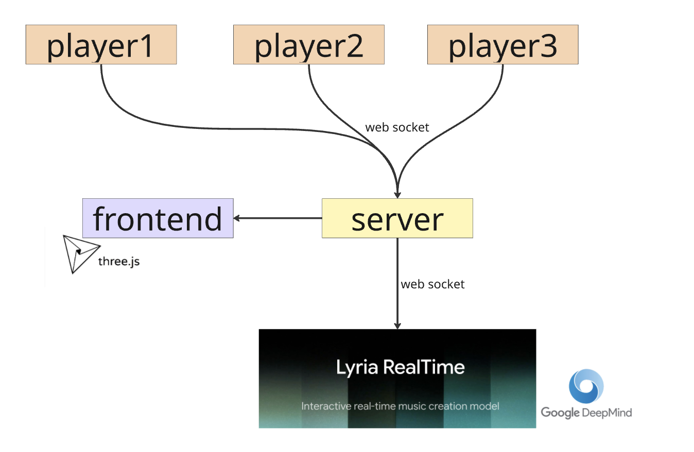
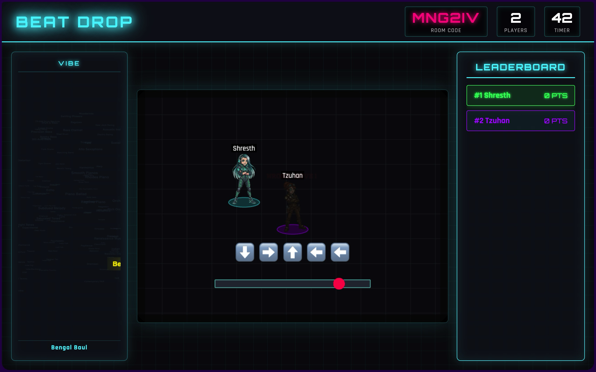
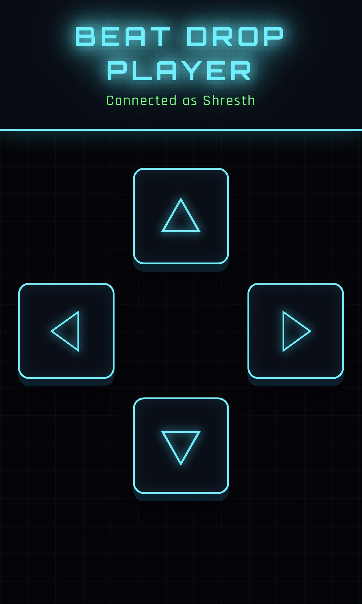
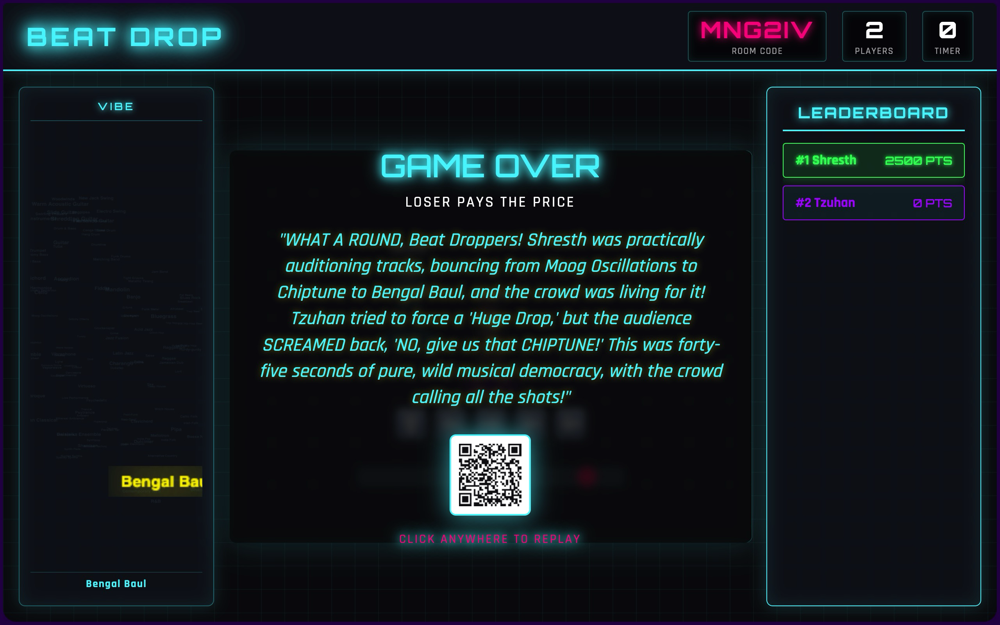

# Beat Drop

A multiplayer rhythm game built on **Lyria 3** — Google's latest real-time music generation model. Players hit beats on their phones while the crowd collectively votes to reshape the live AI-generated soundtrack, beat by beat.







## What It Does

- **Rhythm gameplay** — arrows scroll on the host screen; players tap their phones to hit beats
- **Live music** — Lyria RealTime streams AI-generated music continuously to the host
- **Crowd voting** — every 16 beats, each phone shows 5 random music words; players vote; the winning words update the music immediately
- **3D word cloud** — a Three.js visualization on the host screen shows all 158 possible words, lighting up and glowing as votes come in
- **AI insults** — Gemini Flash generates a custom roast when a player misses a beat


## Vote → Music Flow

```
Phone taps word
  → server tallies panelVotes
  → host sidebar lights up (live)
  → 4-beat timer expires
  → applyVoteResult():
      top 5 words → weighted prompts (proportional to vote count)
      winner word → density / brightness / guidance preset
      → lyriaSession.setWeightedPrompts()
      → lyriaSession.setMusicGenerationConfig()
      → music shifts
```

## Stack

| Layer | Tech |
|---|---|
| Server | Node.js, Express, Socket.io |
| Game engine | Phaser 3 |
| 3D word cloud | Three.js + OrbitControls |
| AI music | Google Lyria RealTime (`lyria-realtime-exp`) |
| AI text | Google Gemini Flash (insult generation) |
| Audio playback | Web Audio API (base64 PCM chunks) |
| Word embeddings | UMAP 3D coords (`music_coords.json`) |

## Setup

```bash
npm install
```

Create a `.env` file:

```
GEMINI_API_KEY=your_key_here
```

Run:

```bash
node server.js
```

Open `http://localhost:3000` for the host screen. Players scan the QR code to join on their phones.

## Testing Without Players

Hit the test endpoint while the host screen is open:

```
GET http://localhost:3000/test-votes
```

This simulates 12 fake voters, drips votes live into the sidebar, then calls Lyria with the result.

## Word Pool

158 words across three categories — instruments, genres, and moods — sourced from Lyria's official prompt vocabulary. Each word has a tuned `density / brightness / guidance` preset so music changes are noticeable.

## Controls

- **Host screen** — click to start the game
- **Phone** — tap arrow buttons to hit beats; tap a word card to vote during the panel
